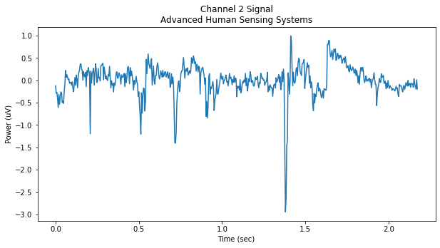
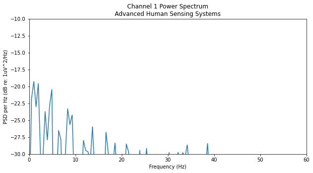
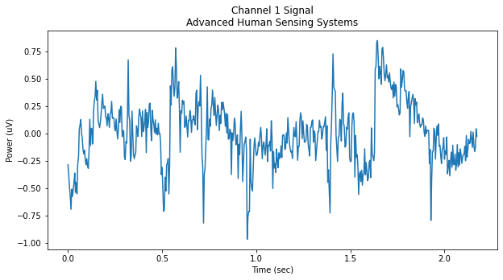

 # A Collection of Python for EEG (+ECG) Analysis Utilities

Working with EEG (electroencephalography) data can be very hard especially if the one does not master the mathematics behind the Processing algorithms., and this little library aims to make it easier. EEGrunt consists of a collection of functions for reading EEG data from CSV files, converting and filtering it in various ways, and finally generating pretty and informative visualizations.

## Welch

## Processing 2

## Processing 3

